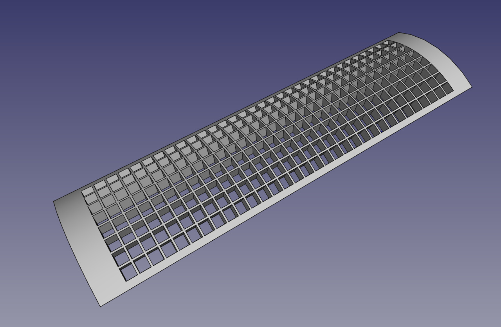
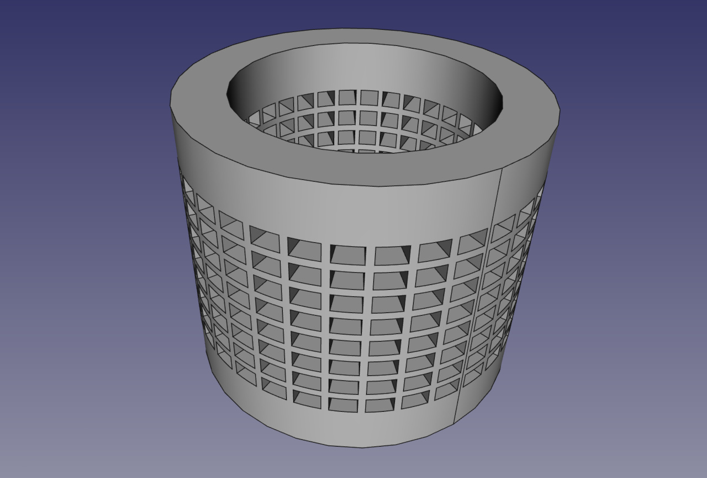
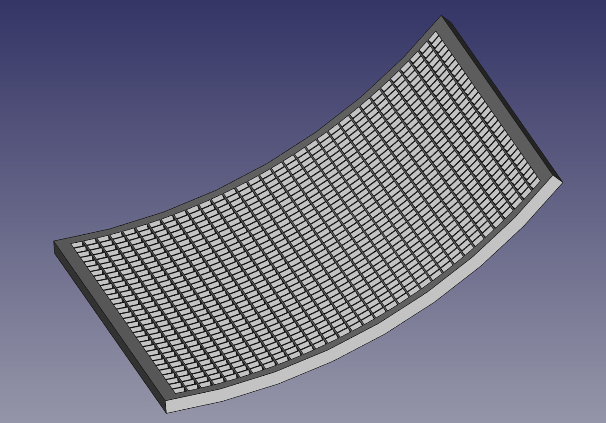
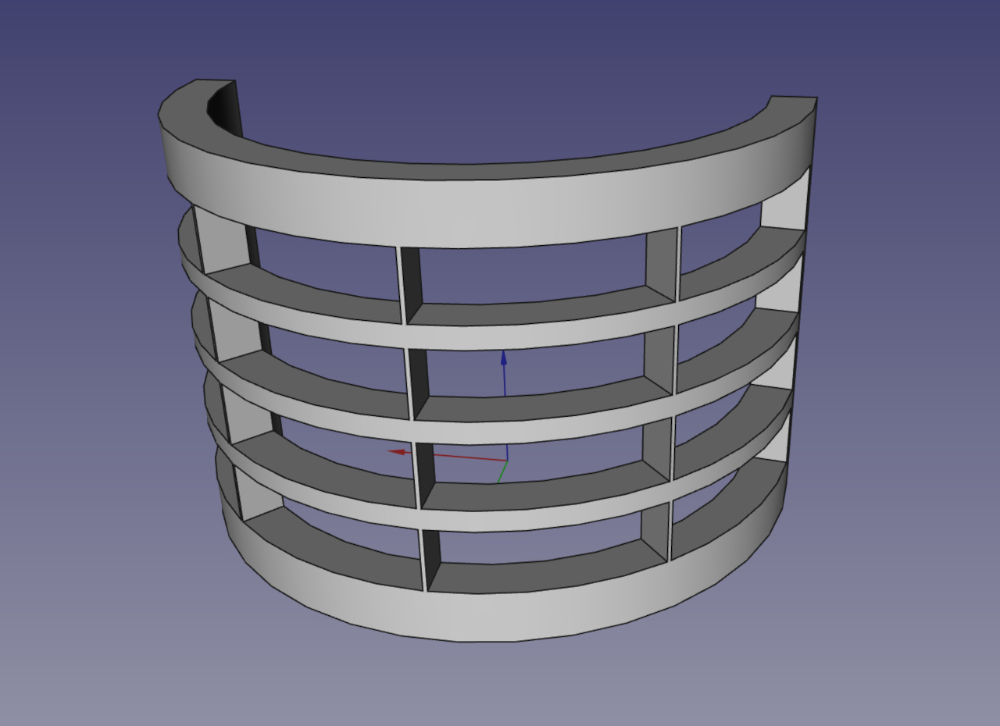

FreeCAD Macro MakeGrid
----------------------

I needed to make a grid for a LED project that will probably never happen, you know how it is ... 
So while I'm at it, I finally published this FreeCAD Macro in a usable form.  

This release allows you to create a curved grid, from these parameters:

    Matrix:
        - Horizontal cells
        - Vertical cells
        - Width (mm)
        - Height (mm)

    Grid :
        - Horizontal angle (mm)
        - Depth (mm)
        - Left side width (mm)
        - Right side width (mm)
        - Upper side height (mm)
        - lower side height (mm)
        - Horizontal spacer width (mm)
        - Vertical spacer height (mm)

The cells are "square" but conform to the curvature of the grid.

Installation
------------

Copy _GridDrawer/_ folder and _Makegrid.FCMacro_ in _~/FreeCAD/Macro/_, then run FreeCAD.

Usage
-----------

- run FreeCAD 
- go to menu "Macro"
- click "Macros ..."
- select "User macros" Tab
- double click "MakeGrid.FCMacro"
- now you can fill in the form with your parameters, click "OK" and wait for the grid !  
  more cells you need, more time is required to compute the grid object. (1024 cells require 8 minutes on my computer)
- you can follow the creation process/parameters in "Report view" window (usually bottom left).
- WARNING : Currently, there are no form validation, 
  so conflicting parameters may produce crash or strange objects from deep space.

Development
-----------

This Macro has been coded and run with FreeCAD 0.19 daily for Ubuntu and Python 3.8.    
This is my first Python development so please be critical and constructive so that I can improve this macro.  
This probably run on other linux system but need your collaboration for Windows.  

I used :
- Ubuntu 20.04 LTS
- FreeCAD-daily 0.19 PPA 
- Python 3.8
- JetBrains PyCharm
- freecad-stubs : https://github.com/CyrilWaechter/freecad-stubs
- PySide2
- Qt Designer
- FreeCAD documentation and many videos and documentations from community :
  - https://wiki.freecadweb.org/
  - https://pythoncvc.net/
  - etc
- git/gitlab.com

Examples
--------

Future
------

You may collaborate to do or complete the following features :  
- accelerate computing time by creating punch tool with basic FreeCAD API (vertices, edges, faces, etc)
- adding punch shapes (cylinder, triangle, hex, user defined, etc)
- adding punch patterns (hex, etc)
- adding punch shape rotation on axis
- adding base grid shapes (cubic, spheric, etc)

